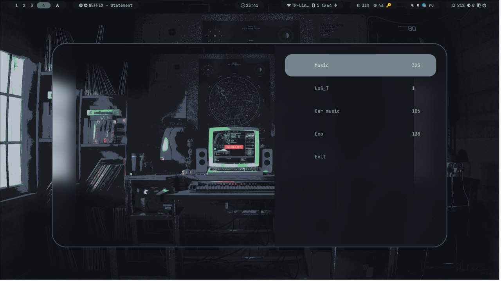

# Rofi Player

Rofi Player is a bash script that uses Rofi, a substitute for windows switch, application launcher and dmenu, to create a simple and interactive music player. 
It uses mpv to play music and mpv-mpris to support `MPRIS`.

## Features
1. Displays all folders (playlists) in the `~/Music` directory.
2. Shows the number of tracks in each playlist.
3. Allows you to select a playlist to play.
4. Plays the selected playlist in random order.
5. Allows you to stop playback and exit the player.
6. Allows to play YouTube playlist directly or by downloading
7. Managing playlists

## Dependensies
1. `Rofi`      		^ 
2. `MPV`       		^ v0.37.0
3. `mpv-mpris` 		^ 
4. `jq`        		^ jq-1.7.1
5. `yt-dlp`    		^ 2024.03.10
6. `notify-send`	^ 0.8.3

## Flags
1. `--offset` It allows you to set the indentation size to the number of songs in the directory
2. `--json_file` Custom way to YT playlists JSON
3. `--logo` Custom way to logo for notify-send

## Using
1. Make sure you have `rofi`, `mpv` and `mpv-mpris` installed.
2. Copy the script to a convenient location.
3. Give the script execute permissions
```sh
chmod +x
```
4. Run the script from the terminal or bind it to a hotkey (for example, in `~/.config/hyprland/keybindings.conf`.
```sh
bind = $mainMod, Y, exec, pkill -x rofi || $scrPath/player.sh --offset=25 # open player
```
5. In the Rofi window that opens, select a playlist to play.

#### More functions
1. `From YouTube` is allows you to enter a URL on playlist, which will be played and saved in json
2. `Save YouTube` is allows you to enter a URL on playlist, which will be played and downloaded as mp3
3. `Delete` is running menu to delete playlist
4. `Exit` is kill player